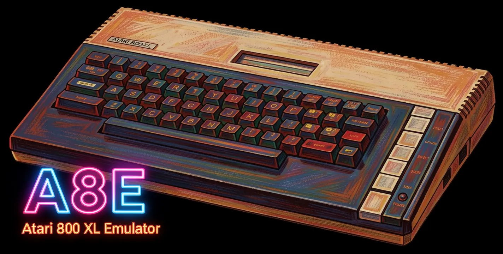

# A8E (Atari 800 XL Emulator)



Atari 800 XL emulator with two implementations in this repository:

- `A8E/`: native C/SDL emulator
- `jsA8E/`: browser JavaScript port (WebGL with CRT post-process, plus 2D canvas fallback)

The original codebase is by Sascha Springer (2004). Each subproject has its own README with detailed usage/build notes.

## Repository Layout

| Directory | Description |
|-----------|-------------|
| `A8E/` | [Native C/SDL code and CMake project](A8E/README.md) |
| `jsA8E/` | [Browser app (`index.html` + JavaScript modules + shaders)](jsA8E/README.md) |
| `disks/` | Optional ATR disk images and XEX executables for testing |

## ROM Requirements

Both implementations require the following ROM dumps (not included):

- `ATARIXL.ROM` (16 KB)
- `ATARIBAS.ROM` (8 KB)

Recommended placement is the repository root:

- Native app loads ROM files from its current working directory.
- Browser app can load ROMs via UI file inputs, and also attempts `../ATARIXL.ROM` + `../ATARIBAS.ROM` when served from repo root.

## Quick Start (Browser)

Serve the repository root with a static HTTP server, then open `jsA8E/`.

```sh
python -m http.server 8000
# open http://localhost:8000/jsA8E/
```

(`file://` is not sufficient because shader and ROM auto-load paths use `fetch()`.)

For an online demo of the jsA8E version, visit https://jsa8e.anides.de/

## Quick Start (Native)

Build from repo root:

```sh
cmake -S . -B build
cmake --build build --target A8E -j
```

Then run the produced `A8E` executable with ROM files in the current working directory.
Typical path after this top-level build is `build/A8E/A8E` (or `build/A8E/A8E.exe` on Windows).

## Controls

Both implementations share the same key mappings.

### Keyboard

Type normally on the emulated Atari keyboard. **Ctrl** and **Shift** work as modifiers, matching the original Atari 800 XL layout.

### Joystick

| Key | Function |
|-----|----------|
| Arrow Keys | Joystick direction |
| **Shift** + Arrow Keys | Atari cursor keys (↑ ↓ ← →) |
| Left Alt | Fire button |

Shift + Arrow is a convenience shortcut — it sends the same key codes as **Ctrl + − / = / + / \*** on the Atari keyboard (the original cursor controls).

### Console Keys

| Key | Function |
|-----|----------|
| F2 | OPTION |
| F3 | SELECT |
| F4 | START |
| F5 | RESET |
| F8 | BREAK |
