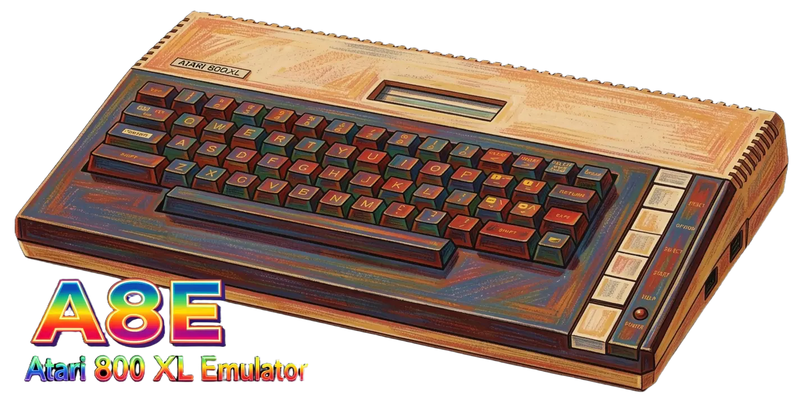

# A8E (Atari 800 XL Emulator)

> Hardware emulation reference: Before implementing any Atari 800 XL PAL machine related hardware emulation, use the [AHRM](/AHRM/index.md) as reference.



Atari 800 XL emulator with two implementations in this repository:

- `A8E/`: native C/SDL emulator
- `jsA8E/`: browser JavaScript port (WebGL with CRT post-process, plus 2D canvas fallback)

The original codebase is by Sascha Springer (2004). Each subproject has its own README with detailed usage/build notes.

## Repository Layout

| Directory | Description |
|-----------|-------------|
| `A8E/` | [Native C/SDL code and CMake project](A8E/README.md) |
| `jsA8E/` | [Browser app (`index.html` + JavaScript modules + shaders)](jsA8E/README.md) |

## Hardware Reference

For hardware behavior and register-level details, use the local [AHRM index](AHRM/index.md), based on the Altirra Hardware Reference Manual.

Special thanks to Avery Lee for creating the Altirra Hardware Reference Manual:
https://www.virtualdub.org/downloads/Altirra%20Hardware%20Reference%20Manual.pdf

## Current Emulation Status

Recent raster-timing work landed in both cores:

- Visible scanlines now render playfield/background state on the per-color-clock path.
- Visible player/missile output is interleaved on the scanline timing path in both implementations.
- Visible blank/background-only lines now spend the initial color-burst clocks invisibly before drawing the live-read remainder of the line.

The implementation pass for legacy-style per-color-clock rendering is now in place in both cores. Remaining work is verification against real raster-effect content and closing any title-specific differences that show up during that sweep.

- regression verification against real raster-effect content
- follow-up on any localized title-specific timing differences found during that verification

For the current verification checklist and signoff notes, see [legacy/COLOR_CLOCK_ACCURACY.md](legacy/COLOR_CLOCK_ACCURACY.md).

## ROM Requirements

Both implementations require the following ROM dumps (not included):

- `ATARIXL.ROM` (16 KB)
- `ATARIBAS.ROM` (8 KB)

Recommended placement is the repository root:

- Native app loads ROM files from its current working directory.
- Browser app can load ROMs via UI file inputs, and also attempts `../ATARIXL.ROM` + `../ATARIBAS.ROM` when served from repo root.

## Quick Start (Browser)

Serve the repository root with a static HTTP server, then open `jsA8E/`.

```sh
python -m http.server 8000
# open http://localhost:8000/jsA8E/
```

(`file://` is not sufficient because shader and ROM auto-load paths use `fetch()`.)

For an online demo of the jsA8E version, visit https://jsa8e.anides.de/

The latest unreleased development version is available at https://dev.jsa8e.anides.de/

## Automation

The browser port includes a stable automation surface at `window.A8EAutomation`.

It is intended to be the canonical shared control surface for debugger/introspection workflows, artifact capture, HostFS access, assembler-driven development flows, and higher-level harnesses. The public surface is grouped into `system`, `media`, `input`, `debug`, `dev`, `artifacts`, and `events` while keeping the earlier flat aliases for compatibility.

Current highlights include worker-acknowledged lifecycle control, URL-native ROM/disk/XEX loading, structured pause/fault events, schema-versioned failure artifacts, HostFS file automation, assembler/XEX helpers, and versioned full-machine snapshot save/load through `system.saveSnapshot()` / `system.loadSnapshot()`. The repository also includes a browser-less Node bootstrap at `jsA8E/headless.js` that instantiates the same automation API against the no-worker backend.

For external agents, CI jobs, scripted regression runs, and other non-interactive control flows, prefer the browser-less bootstrap over driving the browser UI directly. It avoids DOM/worker/UI state, starts with an attached API immediately, and exposes the same grouped automation contract. See the [jsA8E README](jsA8E/README.md) for the overview and [jsA8E/AUTOMATION.md](jsA8E/AUTOMATION.md) for the full public API reference.

## Quick Start (Native)

Building requires **SDL 2** development headers. See the [A8E README](A8E/README.md) for full build instructions covering Windows (MSVC, MinGW), macOS (Homebrew), and Linux.

```sh
cmake -S . -B build -DCMAKE_BUILD_TYPE=Release
cmake --build build -j
./build/A8E/A8E
```

Ensure `ATARIXL.ROM` and `ATARIBAS.ROM` are in the current working directory before starting.

## Controls

Both implementations share the same key mappings.

### Keyboard

Type normally on the emulated Atari keyboard. **Ctrl** and **Shift** work as modifiers, matching the original Atari 800 XL layout.

### Joystick

| Key | Function |
|-----|----------|
| Arrow Keys | Joystick direction |
| **Shift** + Arrow Keys | Atari cursor keys (↑ ↓ ← →) |
| Left Alt | Fire button |

Shift + Arrow is a convenience shortcut — it sends the same key codes as **Ctrl + − / = / + / \*** on the Atari keyboard (the original cursor controls).

### Console Keys

| Key | Function |
|-----|----------|
| F2 | OPTION |
| F3 | SELECT |
| F4 | START |
| F5 | RESET |
| F8 | BREAK |
